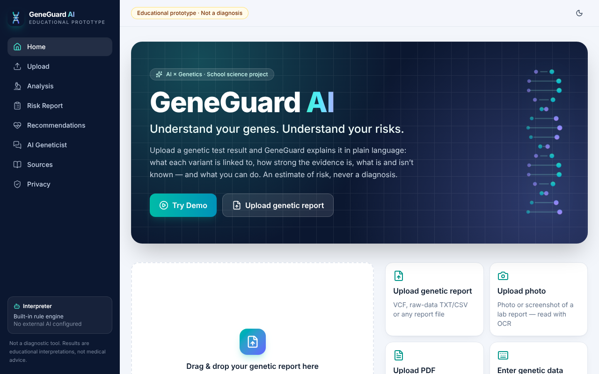
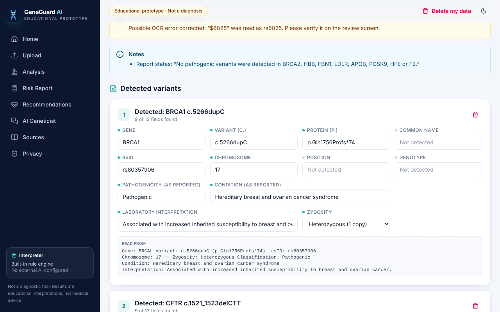
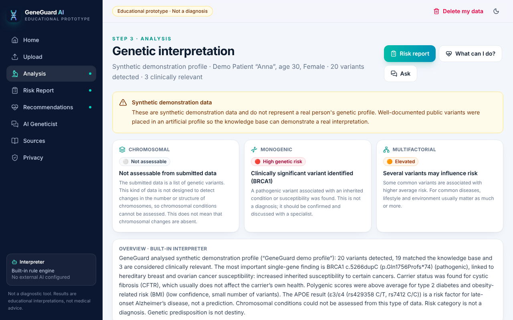
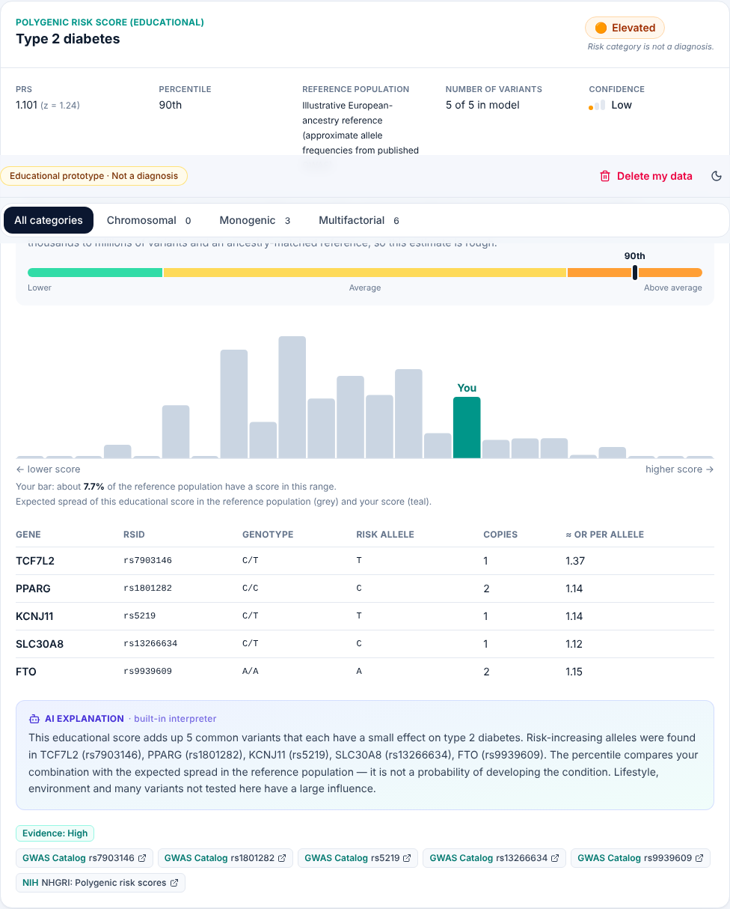
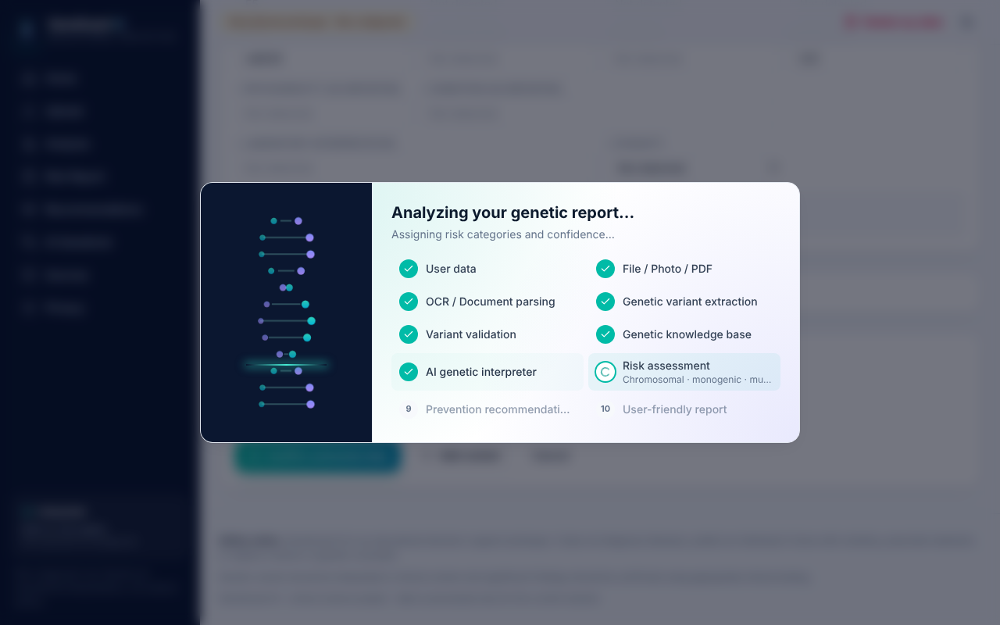
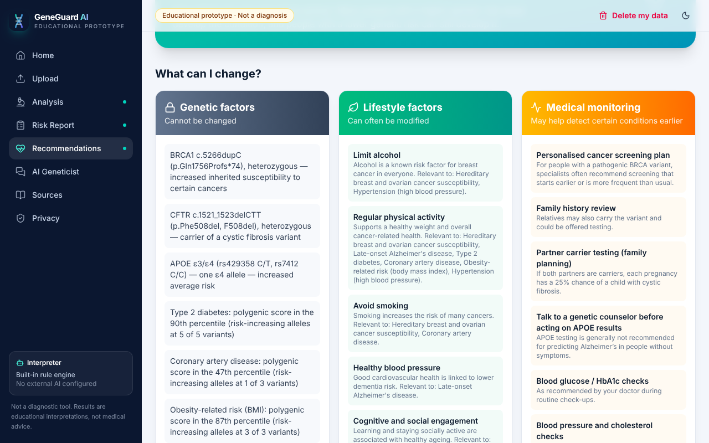

# GeneGuard AI

**Understand your genes. Understand your risks.**

Школьный научный проект: веб‑прототип, который показывает, как ИИ может помогать человеку понимать
результаты генетического тестирования. Приложение принимает фото/скриншот отчёта, PDF, VCF, сырые данные
генотипирования (23andMe‑формат) или ручной ввод. Оно извлекает варианты, сверяет их с базой знаний, оценивает
генетический риск по трём категориям (хромосомные, моногенные, мультифакториальные) и даёт общие
профилактические рекомендации. Всё это сводится в понятный отчёт.

> ⚠️ **GeneGuard AI is an educational decision-support prototype. It does not diagnose diseases, predict an
> individual's future with certainty, prescribe treatment, or replace a doctor or genetic counselor.**
> Результат — это *оценка риска / генетическая интерпретация*, а не диагноз. Значимые находки нужно
> подтверждать клиническими тестами и обсуждать с врачом или генетическим консультантом.

| Главная | Проверка распознанных данных (OCR) |
|---|---|
|  |  |
| **Анализ** | **Полигенный риск (PRS)** |
|  |  |
| **Анимация конвейера** | **«What can I change?»** |
|  |  |

---

## 0. Открыть без установки

**Онлайн‑версия:** <https://claude.ai/artifact/THp4sEBmJsgnepDThjCccX>. Открывается на телефоне и
компьютере, ничего устанавливать не нужно. Всё работает прямо в браузере: демо, OCR фото и PDF, VCF,
анализ, отчёт и встроенный чат. Функции Claude (ИИ‑объяснения, ИИ‑чат, AI Vision) доступны только в
версии с сервером (раздел 1). Ссылка приватная: чтобы её открыли другие (например, учитель), поделитесь
ею через меню **Share** на странице.

**Приложения для Android и Windows:** <https://github.com/zanabekabdumalik-dot/pon/releases/latest>

| Файл | Устройство | Как установить |
|---|---|---|
| `GeneGuard-AI-1.0.0.apk` | Android 7.0+ | Скачайте на телефон, откройте файл, разрешите «Установка из этого источника». |
| `GeneGuard-AI-Setup-1.0.0.exe` | Windows 10/11, 64‑bit | Запустите установщик; ярлык «GeneGuard AI» появится в меню «Пуск» и на рабочем столе. |
| `GeneGuard-AI-Portable-1.0.0.exe` | Windows 10/11, 64‑bit | Запускается без установки (например, с флешки). |

Приложения работают **без интернета**, как режим браузера: демо, OCR фото и PDF, VCF, анализ, отчёт и
встроенный чат. Данные остаются в памяти приложения и стираются при его закрытии. Файлы не подписаны
сертификатом разработчика, поэтому Windows SmartScreen может предупредить: «Подробнее» →
«Выполнить в любом случае». Как устроена сборка — в разделе 7.

---

## 1. Быстрый старт

Нужен **Node.js 20.19+** (лучше 22 LTS).

```bash
cd geneguard-ai
npm install
npm run dev
```

Откройте <http://localhost:5173> **на том же компьютере** и нажмите **Try Demo**.
В консоли сервер печатает и адрес для телефона в той же Wi‑Fi‑сети, например `http://192.168.1.23:5173`.

### Не получается подключиться?

| Что видно | Причина и решение |
|---|---|
| Браузер: «Не удаётся получить доступ к сайту» / «localhost refused to connect» | Сервер не запущен, или адрес открыт на другом устройстве. `localhost` — это «этот же компьютер», поэтому с телефона он не откроется. Запустите `npm run dev` и не закрывайте окно терминала. С телефона откройте адрес «From a phone (same Wi‑Fi)» из консоли или используйте онлайн‑версию (раздел 0). |
| В консоли `Port 5173 is already in use` | Порт занят другой программой (например, вторым запуском). Закройте её или запустите на другом порту: `PORT=5174 npm run dev` (Windows PowerShell: `$env:PORT=5174; npm run dev`). |
| С телефона по адресу `192.168…` не открывается | Телефон и компьютер должны быть в одной Wi‑Fi. Разрешите Node.js в брандмауэре Windows/macOS. В школьных и гостевых сетях устройства часто изолированы друг от друга, тогда используйте онлайн‑версию. |
| `npm: command not found` / ошибка версии Node | Установите Node.js 22 LTS с <https://nodejs.org> и откройте терминал заново. |
| Онлайн‑ссылка не открывается или просит доступ | Ссылка приватная. Откройте её, войдя в claude.ai тем же аккаунтом, или включите доступ по ссылке в меню **Share** на странице. Если вместо приложения видно «The app could not start in this viewer», обновите страницу или откройте ссылку в Chrome, Safari или Edge. |
| В сайдбаре «Built-in engine, in your browser» | Это не ошибка: страница открыта без сервера (статический хостинг или онлайн‑версия). Анализ идёт в браузере, ИИ‑функции выключены. |

**Для запуска не нужен ни один API‑ключ.** Без ключей работают демо‑режим, OCR в браузере, чтение PDF/VCF,
база знаний, оценка риска, встроенные объяснения и встроенный чат. Ключ Anthropic нужен только для текстов,
написанных Claude, ИИ‑чата и режима «AI Vision» (см. раздел 5).

| Команда | Что делает |
|---|---|
| `npm run dev` | режим разработки: сервер и фронтенд на одном порту (5173), горячая перезагрузка |
| `npm run build` | сборка фронтенда в `dist/` (её можно выложить и на статический хостинг, см. раздел 7) |
| `npm run build:artifact` | сборка онлайн‑версии в `dist-artifact/`: одна HTML‑страница со встроенным кодом и файлы OCR/образцов в виде скриптов |
| `npm run build:android` / `npm run build:desktop` | веб‑часть для Android‑ и Windows‑приложений (раздел 7) |
| `npm run app-icons` | перерисовать иконки приложений и заставку Android (нужен Chromium для Playwright) |
| `npm start` | продакшен‑сервер (раздаёт `dist/` и API), порт из `PORT` |
| `npm test` | 25 юнит‑тестов (парсеры, движок риска, безопасность, чат, реальный OCR‑вывод) |
| `npm run typecheck` | проверка типов TypeScript |
| `npm run samples` | пересоздать образцы документов в `public/samples/` (нужен Chromium для Playwright) |

---

## 2. Что умеет приложение

**Входные данные**
- 📷 **Фото / скриншот** отчёта → OCR (Tesseract.js) прямо в браузере → извлечение → экран проверки,
  где можно исправить ошибки OCR → кнопка **Confirm extracted data**.
- 📄 **PDF**: текстовый слой через pdf.js; если страница — скан, она рендерится и распознаётся OCR.
- 🧬 **VCF** (`.vcf`, `.vcf.gz`): CHROM, POS, ID/rsID, REF, ALT, QUAL, FILTER, INFO (GENE, ANN, CSQ, CLNSIG),
  GT/GQ/DP. Строки, не являющиеся корректными VCF‑записями, **пропускаются, а не интерпретируются**.
- 🔢 **Сырые данные генотипирования** (23andMe / AncestryDNA, `.txt`/`.csv`).
- ⌨️ **Ручной ввод** и вставка текста отчёта.
- ▶️ **Demo Mode**: три синтетических профиля и восемь образцов файлов для «живого» конвейера.

**Анализ**
- **Chromosomal**: кариотип (`47,XX,+21`, `45,X`, `47,XXY`, `del(22)(q11.2)`, мозаицизм) и NIPT
  (скрининг). Статусы: detected / screening positive / not detected / insufficient data.
  Если загружен обычный список SNP, приложение пишет **«Not assessable from submitted data»** и **не
  утверждает**, что хромосомных нарушений нет.
- **Monogenic**: BRCA1/2, CFTR, HBB, FBN1, LDLR, APOB, PCSK9, HFE, F5, F2. Для каждой находки показаны Gene,
  Variant, Condition, Inheritance, Clinical significance, Evidence level, Confidence и Risk interpretation.
  Учитываются носительство, зиготность, компаунд‑гетерозиготы (HbS+HbC, C282Y/H63D) и расхождения между
  отчётом и базой.
- **Multifactorial**: учебные полигенные шкалы (PRS) для диабета 2 типа, ИБС, ожирения и гипертонии.
  Показываются PRS, перцентиль, референсная популяция, число вариантов и confidence. Отдельно — APOE ε2/ε3/ε4
  и MTHFR. Текст: *«Your calculated polygenic score is in the 82nd percentile compared with the selected
  reference population»*; это **не вероятность** заболеть.
- Шкала риска: 🟢 Low · 🟡 Average/uncertain · 🟠 Elevated · 🔴 High. Рядом всегда стоит
  *«Risk category is not a diagnosis.»*, а уверенность (High / Medium / Low / Insufficient data) показана
  отдельно от уровня доказательности (High / Moderate / Limited / Unknown).

**Страницы**: Home · Upload · Review · Analysis · Risk Report (печать / PDF / .txt) · Recommendations
(«What can you do?», «What can I change?», вопросы врачу) · AI Geneticist (чат) · Sources (Evidence &
Sources) · Privacy (удаление данных). Есть адаптивная вёрстка для телефона и тёмная тема.

**Обработка ошибок** — сообщения дословно из ТЗ: *Unable to identify genetic information* ·
*Only partial genetic information was detected…* · *Insufficient genetic data* ·
*Variant detected, but clinical significance could not be established* ·
*Uncertain interpretation — consult a qualified healthcare professional* · *Evidence is insufficient*.

---

## 3. Структура проекта

```
geneguard-ai/
├── index.html                 # точка входа фронтенда
├── package.json               # скрипты и зависимости (один пакет: фронт + сервер)
├── vite.config.ts             # Vite + React + Tailwind CSS v4
├── tsconfig.json
├── .env.example               # все переменные окружения с пояснениями
├── Dockerfile / .dockerignore # продакшен‑образ
├── capacitor.config.json      # настройки Android‑приложения (Capacitor)
├── android/                   # Android‑проект (Gradle); иконки и заставка — в app/src/main/res
├── desktop/                   # Windows‑приложение: Electron (main.cjs) + electron-builder, иконки в build/
├── public/
│   ├── favicon.svg
│   └── samples/               # синтетические образцы: фото, PDF, скан‑PDF, VCF, raw data, «не генетическое» фото
├── scripts/
│   ├── generate-samples.mjs   # генерация образцов (Playwright)
│   ├── generate-app-icons.mjs # иконки Android/Windows и заставка из favicon.svg
│   ├── build-app.mjs          # сборка веб‑части для приложений (dist-android/, dist-desktop/)
│   └── build-artifact.mjs     # онлайн‑версия одной страницей
├── shared/                    # общий код браузера и сервера (чистый TypeScript)
│   ├── types.ts               # модели данных: варианты, находки, PRS, отчёт
│   ├── messages.ts            # дисклеймеры и обязательные фразы безопасности
│   ├── demo.ts                # синтетические демо‑профили
│   ├── safety.ts              # фильтр ответов ИИ (диагнозы, дозировки, лечение)
│   ├── chat.ts                # встроенный (без API) «генетик» для чата
│   ├── knowledge/             # база знаний: гены, варианты, состояния, PRS‑модели, хромосомные, ссылки
│   ├── parsing/               # VCF, raw data, текст/OCR‑отчёт, кариотип, нормализация, исправление OCR
│   └── engine/                # валидация, интерпретация, PRS, хромосомы, рекомендации, сборка отчёта
├── server/                    # Node.js + Express
│   ├── index.ts               # сервер; в dev подключает Vite, в prod раздаёт dist/
│   ├── config.ts              # чтение .env
│   ├── routes.ts              # /api/health, /api/analyze, /api/chat, /api/ocr/vision
│   ├── clinvar.ts             # (опц.) живой запрос в NCBI ClinVar по rsID
│   └── ai/                    # Claude: промпты, structured output, fallback, фильтр безопасности
├── src/                       # React + TypeScript + Tailwind
│   ├── App.tsx, main.tsx, index.css
│   ├── state/                 # сессия (только память вкладки) и конвейер с анимацией
│   ├── lib/                   # OCR (Tesseract.js), PDF (pdf.js), чтение файлов, API‑клиент
│   ├── components/            # Layout/сайдбар, бейджи риска, карточки, график PRS, анимация ДНК, …
│   └── pages/                 # Home, Upload, Review, Analysis, Report, Recommendations, Chat, Sources, Privacy
├── tests/                     # Vitest + фикстура реального вывода OCR
└── docs/screenshots/
```

### Как устроен конвейер

| Шаг | Где в коде | Где выполняется |
|---|---|---|
| USER DATA → FILE / PHOTO / PDF | `src/lib/files.ts` | браузер |
| OCR / DOCUMENT PARSING | `src/lib/ocr.ts`, `src/lib/pdf.ts` | браузер |
| GENETIC VARIANT EXTRACTION | `shared/parsing/*` | браузер |
| (проверка человеком) | `src/pages/Review.tsx` | браузер |
| VARIANT VALIDATION | `server/routes.ts` (zod) + `shared/engine/interpret.ts` | сервер |
| GENETIC DATABASE / KNOWLEDGE BASE | `shared/knowledge/*`, опц. `server/clinvar.ts` | сервер |
| AI GENETIC INTERPRETER | `server/ai/claude.ts` (или встроенные тексты) | сервер |
| RISK ASSESSMENT | `shared/engine/interpret.ts`, `prs.ts`, `chromosomal.ts` | сервер |
| PREVENTION RECOMMENDATIONS | `shared/engine/recommendations.ts` | сервер |
| USER-FRIENDLY REPORT | `shared/engine/analyze.ts`, `src/pages/*` | сервер + браузер |

**Главный принцип безопасности: «ИИ объясняет, правила решают».** Уровни риска, классификации, evidence и
confidence вычисляются детерминированно в `shared/engine`. Claude может только переписать объяснения
простым языком; поменять риск он не может. Каждый ответ ИИ проходит через `shared/safety.ts`, который
удаляет утверждения‑диагнозы («you have cancer»), уверенные прогнозы, дозировки и советы начать или
бросить лечение.

---

## 4. API‑ключи и переменные окружения

Скопируйте `.env.example` в `.env` (файл `.env` в git не попадает).

| Переменная | Обязательна? | Назначение |
|---|---|---|
| `ANTHROPIC_API_KEY` | нет | включает объяснения от Claude, ИИ‑чат и AI Vision |
| `AI_MODEL` | нет | модель Claude, по умолчанию `claude-opus-5-5` |
| `AI_EFFORT` | нет | `low` / `medium` / `high`, по умолчанию `medium` |
| `ENABLE_CLINVAR_LOOKUP` | нет | `true` — разрешить живой поиск неизвестных rsID в NCBI ClinVar |
| `NCBI_API_KEY` | нет | ключ NCBI (повышает лимит с 3 до 10 запросов/с) |
| `PORT` | нет | порт сервера (по умолчанию 5173) |

Ключи читаются **только на сервере** (`server/config.ts`) и никогда не попадают во фронтенд. Браузер
обращается лишь к `/api/*` своего сервера.

---

## 5. Подключение ИИ (Anthropic Claude)

1. Зарегистрируйтесь в <https://console.anthropic.com/>, создайте API‑ключ и пополните баланс.
2. В `geneguard-ai/.env`:
   ```env
   ANTHROPIC_API_KEY=sk-ant-...
   AI_MODEL=claude-opus-5-5
   ```
   Чтобы сэкономить, можно поставить более дешёвую модель, например `AI_MODEL=claude-haiku-5-5` или
   `claude-sonnet-5-5`.
3. Перезапустите `npm run dev`. В сайдбаре появится «Claude AI available».
4. На экране проверки включите переключатель **Use Claude AI…** (для демо‑данных ИИ включается сам, если
   ключ задан). В чате есть свой переключатель **Use Claude**.

Что происходит технически (`server/ai/claude.ts`, официальный SDK `@anthropic-ai/sdk`):
- **Объяснения**: `client.beta.messages.parse` со **structured output** (zod‑схема), чтобы ответ всегда был
  валидным JSON вида `{overview, findings[], prs[]}`.
- **Чат**: системный промпт с жёсткими правилами плюс компактная сводка отчёта (без имени файла и текста
  документа). Если данных не хватает, модель отвечает *«I don't have enough information to determine
  this.»* и отвечает на языке вопроса.
- **Серверный fallback**: заголовок `server-side-fallback-2026-07-01` и `fallbacks: "default"`. Если модель
  отклонит запрос, API повторит его на рекомендованной резервной модели. Если ИИ недоступен (нет денег,
  нет сети, отказ), приложение молча переходит на встроенные тексты и пишет об этом.
- **AI Vision** (`/api/ocr/vision`): только *дословная транскрипция* изображения. Варианты затем извлекает
  тот же детерминированный парсер, и пользователь снова всё проверяет.

**Какие данные уходят в Anthropic** и только после явного включения: список извлечённых вариантов и сводка
анализа (гены, варианты, генотипы, категории риска). Для AI Vision уходит само изображение. Это честно
описано на странице Privacy, которая подстраивается под реальную конфигурацию сервера.

---

## 6. Подключение OCR

**По умолчанию (без ключей и без интернета): Tesseract.js в браузере.**
- Движок (`tesseract.js`), его WebAssembly‑ядро (`tesseract.js-core`) и английская языковая модель
  (`@tesseract.js-data/eng`) ставятся через npm. Плагин в `vite.config.ts` отдаёт их по адресам `vendor/...`
  в режиме разработки и копирует в сборку `dist/`. Поэтому OCR работает и с сервером, и на статическом
  хостинге. Внешних CDN нет, фото не покидает устройство.
- Перед распознаванием изображение поворачивается по EXIF, масштабируется, переводится в оттенки серого и
  получает лёгкий контраст (`src/lib/ocr.ts`).
- Парсер исправляет типичные ошибки OCR и **сообщает об исправлениях**: `¢.5266dupC → c.5266dupC`,
  `p.GIn → p.Gln`, `BRCAl → BRCA1`, `CIT → C/T`, `$6025 / 1s7412 → rs…` (только в строках таблицы с геном).

**Опционально: Claude Vision.** Если задан `ANTHROPIC_API_KEY`, на экране проверки фото появится кнопка
**Re-read with AI Vision**. Это полезно для плохих фотографий с телефона.

**Другие языки отчётов.** Например, русский:
```bash
npm install @tesseract.js-data/rus
```
Затем добавьте файл `@tesseract.js-data/rus/4.0.0_best_int/rus.traineddata.gz` в список `files` плагина
в `vite.config.ts` (путь `vendor/tessdata/rus.traineddata.gz`), а в `src/lib/ocr.ts` замените
`createWorker('eng', …)` на `createWorker('eng+rus', …)`.
Чтобы понимать русские подписи («Ген:», «Зиготность:»), добавьте их в `KEY_PATTERNS`/`KEY_START_RE` в
`shared/parsing/textReport.ts`.

**Внешний OCR‑API** (Google Cloud Vision, Azure AI Vision и т. п.) подключается так же, как AI Vision:
серверный маршрут получает изображение, возвращает текст, а дальше работает общий парсер
`parseTextInput()`. Ключ такого сервиса храните в `.env` на сервере.

---

## 7. Deployment

Приложение — **один Node‑сервис**: он раздаёт фронтенд и API. Базы данных нет.

### Docker
```bash
cd geneguard-ai
docker build -t geneguard-ai .
docker run -p 8080:8080 -e ANTHROPIC_API_KEY=sk-ant-... geneguard-ai
# http://localhost:8080
```

### Render.com (бесплатный план подходит для демонстрации)
1. New → **Web Service** → подключите репозиторий.
2. Root Directory: `geneguard-ai`
3. Build Command: `npm ci && npm run build`
4. Start Command: `npm start`
5. Environment: `NODE_VERSION=22`, при желании `ANTHROPIC_API_KEY`.

Можно и через Docker: Render сам найдёт `geneguard-ai/Dockerfile`.

### Railway / Fly.io / любой VPS
- Railway: New Project → Deploy from GitHub → Root Directory `geneguard-ai` → те же команды Build/Start.
- Fly.io: `cd geneguard-ai && fly launch` (использует Dockerfile), затем `fly secrets set ANTHROPIC_API_KEY=…`.
- VPS: `npm ci && npm run build && PORT=8080 npm start` за обратным прокси (Caddy/nginx) с **HTTPS**:
  генетические данные нельзя передавать по незашифрованному HTTP.

### Статический хостинг (без сервера)
`npm run build` и выложите папку `dist/` на любой статический хостинг: GitHub Pages, Netlify,
Cloudflare Pages или просто школьный веб‑сервер. Пути относительные, а адреса страниц имеют вид
`…/#/analysis`, поэтому дополнительная настройка не нужна. Если API сервера нет, приложение само
переходит в **режим браузера**: демо, OCR, PDF/VCF, анализ, отчёт и встроенный чат работают на
устройстве пользователя. Claude и ClinVar требуют сервера, потому что ключи нельзя класть во фронтенд.

### Приложения: Android (APK) и Windows (.exe)

Это та же веб‑часть в окне приложения. Она сразу запускается в режиме «на этом устройстве», без сервера.
**В приложения не попадают API‑ключи**, поэтому функций Claude в них нет: объяснения и чат дают
встроенные правила.

| | Android | Windows |
|---|---|---|
| Технология | [Capacitor](https://capacitorjs.com) (WebView) | [Electron](https://www.electronjs.org) + electron-builder |
| Веб‑сборка | `npm run build:android` → `dist-android/`, затем `cap sync` | `npm run build:desktop` → `dist-desktop/` |
| Пакет | `cd android && ./gradlew assembleDebug` → `app/build/outputs/apk/debug/app-debug.apk` | `cd desktop && npm ci && npm run dist` → `desktop/release/*.exe` |
| Что нужно локально | JDK 21 и Android SDK (проще всего через Android Studio) | Windows с Node.js 22 (на Linux/macOS для NSIS нужен Wine) |

**Автоматическая сборка.** Workflow `.github/workflows/apps.yml` собирает APK и оба .exe на серверах
GitHub при каждом изменении `geneguard-ai/`. Готовые файлы лежат во вкладке **Actions** → нужный запуск →
**Artifacts**. Чтобы выпустить версию со ссылками для скачивания, поднимите `version` в `package.json`,
`desktop/package.json` и `versionName`/`versionCode` в `android/app/build.gradle`, затем создайте тег:

```bash
git tag v1.0.1 && git push origin v1.0.1
```

Workflow сам создаст релиз на странице **Releases**.

**Особенности.** На Android нет печати и скачивания файлов из WebView, поэтому в отчёте остаётся кнопка
**Copy report text**. Кнопка «Take a photo with the camera» открывает камеру. Системная кнопка «Назад»
ведёт по истории приложения, а на главном экране закрывает его. В Windows работают печать и сохранение
отчёта, а ссылки на источники (ClinVar, MedlinePlus и т. д.) открываются в обычном браузере.
APK собирается в варианте *debug*, его можно сразу установить. Для Google Play нужна подписанная
release‑сборка (Android Studio → *Build → Generate Signed App Bundle / APK*); ключ подписи нельзя
хранить в репозитории. Иконки перерисовываются из `public/favicon.svg` командой `npm run app-icons`.

---

## 8. Приватность (как реализовано)

- Файлы читаются и распознаются **в браузере**. На сервер уходит только структурированный список
  вариантов; без сервера не уходит ничего.
  Текст документа остаётся в браузере.
- Данные живут **только в памяти вкладки** (React state): ни localStorage, ни cookies, ни базы данных.
  Обновление страницы их стирает. (В localStorage хранится только выбор светлой/тёмной темы.)
- Сервер **stateless**: ничего не сохраняет и не логирует содержимое запросов (в лог пишутся только метод,
  путь, статус и время). Ответы API идут с `Cache-Control: no-store`.
- Кнопки **Delete my data** (в шапке) и удаление по пунктам на странице Privacy.
- Внешние сервисы (Anthropic, NCBI) используются только при наличии ключа/флага **и** согласия
  пользователя. Страница Privacy показывает, что именно включено на этом сервере.

---

## 9. Демо‑режим и образцы

`Upload → Demo & samples`:
- **Demo Patient «Anna»** (30 лет, женщина, синтетика): BRCA1, CFTR (носительство), APOE ε3/ε4, SNP для
  мультифакториальных шкал и один **вымышленный** вариант FBN1. На нём видно, как приложение говорит
  «clinical significance could not be established».
- **Lower-risk SNP panel**: показывает, что «lower risk ≠ no risk».
- **Chromosome analysis report**: кариотип 47,XX,+21, категория Chromosomal.

> *These are synthetic demonstration data and do not represent a real person's genetic profile.*
> Для наглядности в искусственный профиль вставлены хорошо описанные публичные варианты (например, BRCA1
> c.5266dupC). Профиль при этом не принадлежит ни одному человеку.

**Образцы файлов** (`public/samples/`, все синтетические, их можно скачать): фото лабораторного отчёта, частичный
скриншот, цифровой PDF, сканированный PDF, фото кариотипа, VCF (с некачественным вызовом и битой строкой),
raw‑data TXT и «не генетическое» фото (список покупок).

### Сценарий презентации (≈5 минут)
1. **Home → Try Demo**: анимация конвейера → Analysis (BRCA1 🔴, CFTR носитель 🟢, APOE 🟠, PRS 90‑й
   перцентиль, Chromosomal ⚪ «Not assessable»).
2. **Risk Report** → Print / save as PDF.
3. **Recommendations**: «Genetic predisposition is not destiny» и три колонки «What can I change?».
4. **AI Geneticist**: «Does this variant mean I have the disease?» и «What does my LDLR variant mean?»
   (честное «I don't have enough information…»).
5. **Upload → Lab report photo**: настоящий OCR → экран проверки → Confirm → анализ.
6. **Non-genetic photo** → «Unable to identify genetic information.»
7. **Privacy → Delete all my data.**

---

## 10. Научные ограничения (важно для защиты проекта)

- База знаний — **упрощённый учебный срез** публичных ресурсов (ClinVar, dbSNP, OMIM, GWAS Catalog,
  MedlinePlus Genetics, NIH). Классификации со временем меняются. Неизвестные варианты честно помечаются
  как неинтерпретируемые.
- **PRS — учебные**: 3–5 SNP на признак, округлённые OR и частоты аллелей, распределение посчитано точно
  (Харди — Вайнберг, независимость SNP). Настоящие клинические шкалы используют тысячи–миллионы вариантов
  и референс, подобранный по происхождению. Поэтому confidence у них всегда **Low**.
- Референс «European-ancestry»: у людей другого происхождения PRS переносится плохо. Это известная
  проблема генетики, она отмечена в интерфейсе.
- Потребительские SNP‑чипы часто ошибаются на редких вариантах, поэтому такие находки получают confidence
  **Low** и рекомендацию подтвердить клиническим тестом.
- Это не медицинское изделие: нет клинической валидации, информированного согласия, шифрования хранилища
  и т. д. Реальной системе всё это понадобилось бы.

## Источники

[ClinVar](https://www.ncbi.nlm.nih.gov/clinvar/) · [dbSNP](https://www.ncbi.nlm.nih.gov/snp/) ·
[OMIM](https://omim.org/) · [GWAS Catalog](https://www.ebi.ac.uk/gwas/) ·
[MedlinePlus Genetics](https://medlineplus.gov/genetics/) · [NHGRI](https://www.genome.gov/) ·
Richards et al. 2015, ACMG/AMP variant interpretation standards (PMID 25741868).
